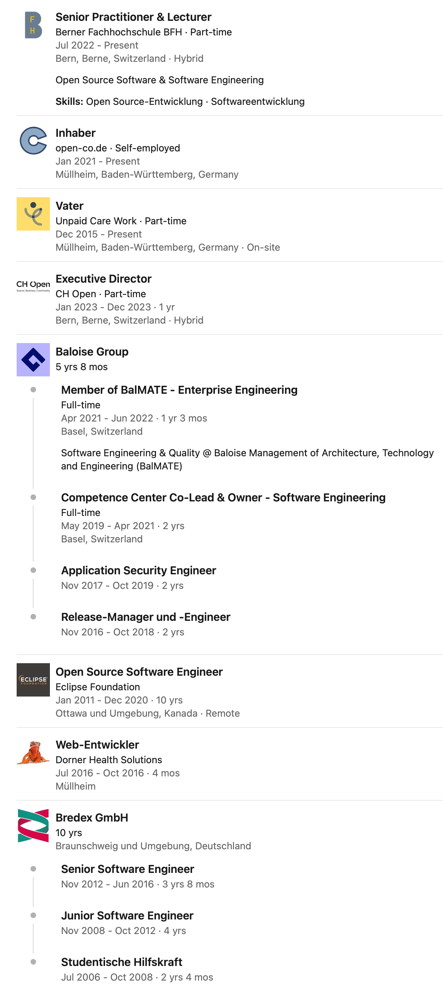
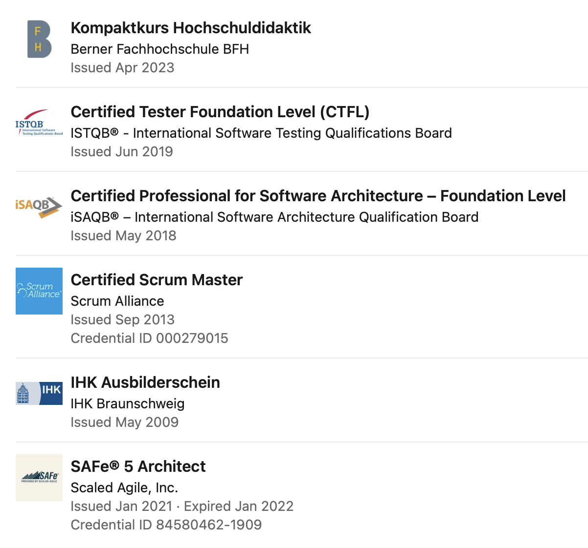
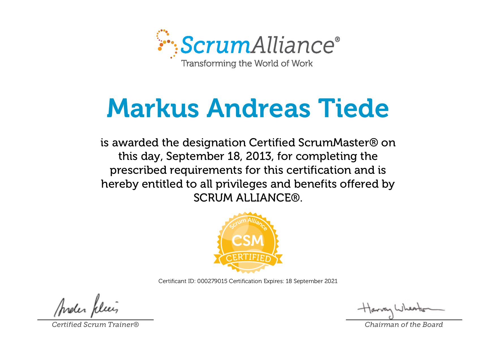

# Marku[s](https://github.com/MarkusTiede/about/blob/master/slides/intro/PITCHME.md) Andreas Tiede

> «Digitale Transparenz & Offenheit unternehmerisch gelebt - so gehen wir gemeinsam & souverän in eine nachhaltige Zukunft.»


```
Dipl.-Inf. (FH)
* 28.06.1985
```

## role(s)

### Lecturer & consultant as [Senior Open Source Practitioner](https://www.bfh.ch/de/aktuell/news/2022/markus-tiede/) @ Digital Sustainability Lab within the [Institute for Public Sector Transformation](https://www.bfh.ch/en/research/research-areas/public-sector-transformation/) | Bern University of Applied Sciences | BFH
### Executive Director @ [CH Open](https://www.ch-open.ch/en/ueber-ch-open/executive-board/)
### Member of the [DINAcon](https://dinacon.ch) organizing committee
### [Intr`]open[`eur](https://en.wikipedia.org/wiki/Intrapreneurship)

## experience(s)



## bio

### en
Markus is a software developer and release engineer with focus on high quality standards. Besides being a former open-source Eclipse Foundation committer and Package Maintainer for „Eclipse for Testers“ he holds a Diplom (German degree) in Computer Science from the [University of Applied Sciences in Braunschweig][ostfalia-en].

### de
Markus arbeitet als Softwareentwickler und Release-Engineer mit starkem Fokus auf hohe Qualitätsstandards. Markus ist darüber hinaus ein ehemaliger open-source Eclipse Foundation Committer, Package Maintainer für „Eclipse for Testers“ und hat einen Abschluss als Diplom-Informatiker von der [FH Braunschweig-Wolfenbüttel][ostfalia-de].

## [qualifications / Qualifikationen](#other-qualifications--weitere-qualifikationen)



### memberships / Mitgliedschaften

| where | what |
| :--: | :--: |
| [](https://muellheim-neuenburg.lions.de) | member & [webmaster](https://muellheim-neuenburg.lions.de/vorstand) |
| [](https://www.mensa.de) | member |

### other references / weitere Referenzen

| profiles @... |
| :--: |
| [](https://twitter.com/MarkusTiede) |
| [](https://www.ch-open.ch/en/ueber-ch-open/vorstand/) |
| [](https://accounts.eclipse.org/users/mtiede) |
| [](https://apps.apple.com/de/developer/markus-tiede/id1086476841) |
| [**OpenHub.net**](https://www.openhub.net/accounts/MarkusTiede) |
| [](https://www.linkedin.com/in/markus-tiede) |

## ToC / Inhaltsverzeichnis

|      | [talks / Vorträge](#talks--vorträge) | [paper / Artikel](#paper--artikel)  |
|:----:| ------------------:| ------------------:|
| 2023 | [...](#talks-2023) |                    |
| 2022 | [...](#talks-2022) |                    |
| 2021 | [...](#talks-2021) | [...](#paper-2021) |
| 2020 | [...](#talks-2020) |                    |
| 2019 | [...](#talks-2019) |                    |
| 2018 | [...](#talks-2018) |                    |
| 2017 | [...](#talks-2017) |                    |
| 2016 |                    |                    |
| 2015 | [...](#talks-2015) | [...](#paper-2015) |
| 2014 | [...](#talks-2014) | [...](#paper-2014) |
| 2013 | [...](#talks-2013) | [...](#paper-2013) |
| 2012 | [...](#talks-2012) | [...](#paper-2012) |
| 2011 | [...](#talks-2011) |                    |
| 2010 | [...](#talks-2010) | [...](#paper-2010) |
| 2009 | [...](#talks-2009) |                    |
| 2008 | [...](#talks-2008) |                    |

## talks / Vorträge

### talks 2023

#### `de` [IIBA - Swiss German Chapter](https://swissgerman.iiba.org/event/open-source-was-bedeutet-das-fur-business-analysten-what-does-it-mean-business-analysts) - [OPEN SOURCE - WAS BEDEUTET DAS FÜR BUSINESS ANALYSTEN?](https://github.com/bfh/opensource/blob/main/docs/slides/2023-iiba/content.md)



Was bedeutet "Open Source" für Business Analysten? Unsere einstündige (online) Session wird sich um die Einordnung und die Beantwortung ebendieser Frage drehen.
- Wir starten kurz mit den Grundlagen der Business Analyse und wie Open-Source-Prinzipien diese (unter)-stützen.
- Weiter geht es mit einem kurzen Ausflug zu den „Top Low-Hanging Open-Source-Fruits“-Alternativen: 10 Tools in 10 Minuten.
- Im Anschluss werden wir uns eingehender mit Open-Source Grundlagen beschäftigen, konkret mit: Lizenzen und anderen Bewertungskriterien, die bei der Evaluation eine wichtige Rolle spielen.
- Abgerundet wird der Vortrag durch eine Vorstellung nationaler sowie internationaler Aktivitäten und aktuellen Trends.

Im Anschluss an den Vortrag wird es zudem genügend Zeit für Fragen sowie einen offenen und lockeren Austausch geben.

### talks 2022

#### `de` [Forschungsstelle Digitale Nachhaltigkeit - Institut für Informatik der Universität Bern](https://www.digitale-nachhaltigkeit.unibe.ch) - [Gastreferat zu "Digital nachhaltige Unternehmens-IT"](https://github.com/baloise/open-source/issues/313)


#### `de` [Bits & Bäume 2022](https://bits-und-baeume.org) - [OSS-Maturität in Unternehmen](https://fahrplan22.bits-und-baeume.org/bitsundbaeume/talk/BWSLF3/)

- [Folien & Quellen](https://github.com/digital-sustainability/open-source/blob/main/docs/slides/2022-bb/content.md)



Was macht dein Unternehmen mit Open-Source Software: ignorieren, nutzen oder gar mitwirken?

Wir steigen ein mit einem leichtgewichtigen Maturitätsmodell zur eigenen Standortbestimmung; diskutieren dann individuelle Vor- und Nachbedingungen sowie Empfehlungen für das erfolgreiche Beschreiten dieses, nach unserem Verständnis, unausweichlichen Weges für moderne Unternehmen im digitalen Zeitalter.

Abgerundet wird der Vortrag durch eine ganze Reihe von Erfahrungen, Referenzen und weiterführenden Informationen aus verschiedenen Unternehmen und Wirtschaftszweigen.

#### `de` [digitalswitzerland Schweizer Digitaltage](https://digitaltage.swiss/programm/digitale-nachhaltigkeit/) - [Open Source, Open Data und TikTok: Podium zur digitalen Nachhaltigkeit](https://www.generationentandem.ch/online/volldigital/digitale-nachhaltigkeit/)

Veranstaltung im Rahmen der Schweizer Digitaltage: Unter dem Motto «Gemeinsam gestalten wir die Zukunft» bietet der Wirtschaftsraum Thun vom 7.–10. September als Partnerstadt und -Kanton der Schweizer Digitaltage gemeinsam mit verschiedenen regionalen Institutionen zahlreiche live- und online-Events an. Mit einem vielfältigen Angebot ist auch und» das Generationentandem als PartnerIn des WRT Thun wieder massgeblich beteiligt.



Fachpersonen im Gespräch mit der Politik über Digitale Nachhaltigkeit. Das Politpodium von «und» das Generationentandem im Rahmen der Schweizer Digitaltage in Zusammenarbeit mit dem Wirtschaftsraum Thun sensibilisiert für digitale Themen. Alle Generationen sollen fit gemacht werden für die Reise durch die digitale Gegenwart und in die digitale Zukunft.

Im Podiumsgespräch wird ein Blick in die Zukunft der digitalen Welt gewagt. Welche Chancen und Risiken bringen Social Media, Big Data und neue Technologien morgen? Wie profitieren wir davon? Wie können wir unser Wissen für die Zukunft digital sichern? Und welche Gefahren müssen wir als Gesellschaft und als Individuen im Auge behalten? VertreterInnen aus Wissenschaft, Politik und Praxis tauschen sich aus und geben Antworten, auch auf Fragen aus dem Publikum.

#### `de` [SITIC DL Topic Forum](https://sitic.org/digital-sustainability/) - [Keynote Nachhaltige Digitalisierung &| Digitale Nachhaltigkeit?](https://github.com/open-co-de/2022-sitic-dina-workshop/blob/main/slides/index.html)


“Nachhaltige Digitalisierung” oder “Digitale Nachhaltigkeit”: Zwei untrennbare Perspektiven der selben Medaille oder Wortklauberei in der IT Branche? Eine Antwort auf diese zentrale Frage der aktuellen Zeit, gestützt durch Beispiele aus jahrelanger Praxis, angereichert mit konkreten Massnahmen sowie versehen mit klar messbaren KPIs wird diese erste Session den Teilnehmenden mit auf den Weg geben.

#### `de` [Swiss Internet Governance Forum – Swiss IGF 2022](https://igf.swiss) - [Inputreferat im Plenum 3: Datenbasierte Gesellschaft und politische Souveränität](https://igf.swiss/swiss-igf-2022/sessionpage2022-pl3/)




In immer mehr Bereichen unserer Gesellschaft und Wirtschaft sind Bestrebungen im Gang, eine innovative Nutzung von Daten zu fördern, um bessere und bedürfnisgerechtere Dienstleistungen anzubieten und um knappe Ressourcen effizienter zu verwalten. In einem [Bericht des UVEK und des EDA](https://www.newsd.admin.ch/newsd/message/attachments/70835.pdf) werden Beispiele aus den Bereichen Gesundheit, Mobilität, Energie, Bildung und Finanzwesen genannt. Auch im Tourismus und anderen Branchen arbeitet man an Modellen, wie lokale Akteure gemeinsam Daten nutzen, um Kunden ein besseres Erlebnis zu bieten und neue Perspektiven für die lokale Wertschöpfung zu generieren. In den Kantonen Genf und Waadt haben sich verschiedene Akteure zu einem [«trust valley»](https://trustvalley.swiss) zusammengeschlossen, um Innovation durch sichere und gemeinsame Datennutzung zu fördern. Am 30. März 2022 hat der Bundesrat verschiedene [Massnahmen](https://www.admin.ch/gov/de/start/dokumentation/medienmitteilungen.msg-id-87780.html) zur Förderung von vertrauenswürdigen Datenräumen und der «digitalen Selbstbestimmung» beschlossen, darunter die Erarbeitung eines freiwilligen Verhaltenskodexes für vertrauenswürdige Datenräume. Ein Bericht des Bundes zu einem künftigen «digitalen Service Public» soll noch dieses Jahr verabschiedet werden. Die EU hat eine [europäische Datenstrategie](https://ec.europa.eu/info/strategy/priorities-2019-2024/europe-fit-digital-age/european-data-strategy_de) verabschiedet und kürzlich die Schaffung eines [europäischen Gesundheitsdatenraums](https://ec.europa.eu/health/ehealth-digital-health-and-care/european-health-data-space_de) vorgeschlagen.

Gleichzeitig sind viele Individuen und auch Unternehmen skeptisch gegenüber solchen Vorschlägen, denn sie befürchten, die Kontrolle über ihre eigenen Daten zu verlieren oder ihre bestehenden Wettbewerbsvorteile und Geschäftsmodelle zu gefährden. Zudem sehen viele in der – mit der zunehmenden Datennutzung einhergehenden – Plattformisierung aller Bereiche unserer Gesellschaft und Wirtschaft das Risiko einer weiteren Abhängigkeit von grossen internationalen Tech-Giganten und fürchten um die «digitale Souveränität» unserer Gesellschaften.

Auf Basis von 3 kurzen Inputreferaten sollen die Anwesenden möglichst interaktiv miteinander diskutieren, wie wir auch in der Schweiz das Datenpotential besser nutzen und welche Hürden dabei zu bewältigen sind. Ebenso soll darüber gesprochen werden, wie wir die Interoperabilität mit und Teilnahme in den entstehenden Datenräumen in Europa und darüber hinaus sicherstellen und wie und wie wir unsere «digitale Souveränität» und «digitale Selbstbestimmung» stärken können.

#### `de` [Digital Business und Value Networks - Fachhochschule Nordwestschweiz](https://www.fhnw.ch/de/studium/wirtschaft/digital-business-value-networks) - [Gastreferat zu Open Source Software und Open Government Data](https://github.com/baloise/open-source/issues/331)


 - https://oss-studie.ch
 - https://opendata.swiss

#### `en` [Open Education Day](https://openeducationday.ch) - [reveal.js - Hands-on with the open (source) presentation framework](https://openeducationday.ch/programm-2022/workshops/reveal-js-hands-on-with-the-open-source-presentation-framework/)

[](https://openeducationday.ch/wp-content/uploads/sites/5/2021/11/Promo-OED-2021.mp4)

Get your hands dirty with reveal.js - one of the industry leading open (source) presentation framework.

In this workshop we will cover together:
 - the initial, technical setup: online & offline
 - basic steps of coding slides using HTML & CSS - as well as simply designing slides by using markdown
 - real-world use-cases and very useful and nifty best-practices when presenting

### talks 2021

#### `de` [Forschungsstelle Digitale Nachhaltigkeit - Institut für Informatik der Universität Bern](https://www.digitale-nachhaltigkeit.unibe.ch) - [Gastreferat zu "Digital nachhaltige Unternehmens-IT"](https://github.com/baloise/open-source/issues/313)


#### `de` DINAcon Awards
 - [dinacon.ch](https://awards.dinacon.ch)
 - [Video @ YouTube](https://youtu.be/gro2h1Rsfr0)
 - [GitHub](https://github.com/dinacon/awards)
 - [Pressemitteilung](https://www.ch-open.ch/die-fuenfte-dinacon-zum-ersten-mal-hybrid-zum-ersten-mal-in-basel/)


 
Mit den DINAcon Awards werden jedes Jahr an der Konferenz für **DI**gitale **NA**chhaltigkeit Open-Projekte von Communities, Unternehmen, Verwaltungen, Organisationen und Einzelpersonen ausgezeichnet. Die Teilnahme ist kostenlos, teilnahmeberechtigt sind Projekte aus ganz Europa.

Mit den DINAcon Awards wurden 2021 Projekte in den Kategorien "Open Data" Award, "Open Government" Award, "Best Newcomer" Award und "Open Community" Award ausgezeichnet.

Die Gewinner der DINAcon Awards 2021 wurden am 29. Oktober 2021 live im Baloise Park Ost in Basel ausgezeichnet. Die Zeremonie fand im Anschluss an den spannenden Konferenztag mit Keynotes von Julia Reda und Paul-Olivier Dehaye & 11 Fachsessions statt.

#### `en` Thematic Event on Digital Sustainability : B Lab & Swiss Triple Impact and CH Open

- [Slide - src](https://github.com/baloise/open-source/blob/main/docs/slides/ws-digital-sustain/content.md)

Digitalization and sustainability are omnipresent concepts. But how can they be thought of together? The answer seems trivial: digital sustainability. What exactly digital sustainability means, what it encompasses and what prerequisites are necessary for it will be explained to you during the workshop "Digital Sustainability" and illustrated with a use case at Basler Versicherung.

Join us for our thematic workshop with Dr. Matthias Stürmer, president CH Open & professor at BFH and Markus Tiede, vice president CH Open & Software-Engineer at Basler Versicherung.

#### `de` Jahresrückblick 2020 : swissICT Partnerverband CH Open



#### `de` `Visionär*innen` : Zukunftsvisionen für ein digitales Basel beim [DigitalLabor](https://www.digital-labor.ch)

Die Digitalisierung prägt bereits jetzt fast alle unsere Lebensbereiche. Das DigitalLabor setzt sich für einen digitalen Wandel ein, den wir alle verstehen und aktiv mitgestalten können. Auf unserer Tour durch die Schweiz fragen wir Dich: Wie sieht eine (digitale) Zukunft aus, in der du gerne leben möchtest?

Wie soll das digitale Basel der Zukunft aussehen? Sechs Baslerinnen und Basler präsentieren ihre Vision von Arbeit, Politik und Kultur vor Ort im Jahr 2030. Im Anschluss wird das Publikum die Möglichkeit haben, diese Visionen zu ergänzen und zu hinterfragen. So entstehen über den Abend hinweg eine Sammlung von Perspektiven auf eine wünschenswerte digitale Zukunft Basels und ein buntes Panorama konkreter Vorschläge und Ideen, wie sie sich realisieren lassen.

#### `de` Open Source #1 - was die Welt im Innersten zusammenhält
 - Clubabend - [Lions Club Müllheim Neuenburg](https://muellheim-neuenburg.lions.de)

```
Vergangenheit & Grundlagen : Wissen – Allmende – Freiheit
Die Gegenwart : die freie Wahl
Die Zukunft : Souveränität & Nachhaltigkeit
```

### talks 2020

#### `de` DINAcon Awards
 - [dinacon.ch](https://awards.dinacon.ch)
 - [Video @ YouTube](https://youtu.be/xDKVweM_Alo?t=18702)
 - [GitHub](https://github.com/dinacon/awards)


 
Mit den DINAcon Awards werden jedes Jahr an der Konferenz für **DI**gitale **NA**chhaltigkeit in Bern Open-Projekte von Communities, Unternehmen, Verwaltungen, Organisationen und Einzelpersonen ausgezeichnet. Die Teilnahme ist kostenlos, teilnahmeberechtigt sind Projekte aus ganz Europa.

Die Awards werden in diesem Jahr statt im Welle7 Workspace wie gewöhnlich, in einer virtuellen Mozilla Hubs Welt vergeben! Wir können es kaum erwarten, euch die Awards-Welt vorzustellen.

In den 5 Kategorien "Open Data", "Business", "Open Government", "Newcomer" und "Community" werden diese Jahr die Awards verliehen und die jeweils 15 FinalistInnen stehen fest. Es war definitiv keine einfache Entscheidung! Umso mehr freuen wir uns darüber Ihnen jetzt das Juryresultat präsentieren zu dürfen.

#### `de` Open Source @ Baloise
 - [Baloise Open Day](https://www.openfriday.org)
 


Wir sind Versicherung und Bank in einem und das mit über 150 Jahren Tradition. Mindestens ähnlich alt ist die Idee des Gemeinguts, oder Allmende.

Im Zeitalter der Digitalisierung ergeben sich für diese altbewährten Konzepte neue Chancen. Denn die sogenannte Wissensallmende, also digitalisierte Ideen und Informationen, hat einen entscheiden Vorteil: im Unterschied zu Acker- oder Weideland verlieren Informationen durch intensive Nutzung nicht an Wert. Im Gegenteil: die gemeinsame Nutzung und Pflege solcher Güter lohnt sich heute mehr denn je - Stichwort Open-Source!

Wie wir das bei der Basler leben und was wir in den letzten Jahren schon erreicht haben, wollen wir euch sehr gerne zeigen!

### talks 2019

#### `de` Open-Source (Software) in der Versicherung(swelt)
 - [DINAcon][t.2019.dina]



Versicherung und Open-Source - (wie) passt das zusammen? Diese Session gibt am Beispiel der langjährigen Erfahrungen in der Basler Versicherung einen detaillierten Einblick zum Thema "Einsatz von", "Zusammenarbeit mit" und "Freigabe von" Open-Source (Software).

Schon seit einigen Jahren gibt es eine aktive Open-Source Community (https://github.com/baloise) innerhalb des Schweizer Versicherungskonzerns. Wir wollen im Rahmen dieser Session vorstellen,
 - welche open-source Projekte bei uns im (produktiven) Einsatz sind,
 - an welchen Projekten wir (wie) aktiv mitarbeiten,
 - und welche Artefakte wir selber schon publizieren.

Diese Vorstellung wird eingerahmt von Erkenntnissen und Lessons-Learned die wir entlang dieses Entwicklungspfades gesammelt haben.

#### `de` (Wissens)-Allmende 2.0 by Baloise Group
 - [Digitaltag Schweiz][t.2019.dt]
 - [Slides][t.2019.dt.slides]

Die Baloise ist Versicherung und Bank in einem und das mit über 150 Jahren Tradition. Mindestens ähnlich alt ist die Idee des Gemeinguts, oder Allmende.

Im Zeitalter der Digitalisierung ergeben sich für diese altbewährten Konzepte neue Chancen. Denn bei der sogenannten Wissensallmende, also digitalisierte Ideen und Informationen, spielt die so genannte "Problematik der Allmende" keine Rolle: Im Unterschied zu Acker- oder Weideland verlieren Informationen durch intensivere Nutzung nicht an Wert. Eine intensive, gemeinsame Nutzung und Pflege solcher Güter lohnt sich also heute mehr denn je!

Wie wir das bei der Basler leben, wohlgleich noch seinen Anfängen, wollen wir euch sehr gerne zeigen!

### talks 2018

#### `en` Pipelining quality - best practices, lessons learned and tools for continuous delivery processes
 - [BaselOne][t.2018.bo]
 - [Slides][t.2018.bo.slides]

In this talk Markus will share hands-on project experience for building and maintaining CI processes applicable in small and large enterprises projects.

After a short introduction to the project context Markus will focus on best practices, lessons learned and tools used within automated deployment chains based on state-of-the-art Jenkins pipelines.

In this talk you will join the journey of an epic, a user story and a bugfix from

 - its beginning as requirement or defect,
 - over its implementation in source code,
 - to both static and dynamic code quality assurance mechanisms,
 - its rollout in integration and acceptance stages,
 - up to its deployment, monitoring and maintenance in production

This talk aims at anyone interested in general ideas and means for continuous integration techniques in both agile and classic project layouts.

Besides his many years of experience in test automation, Markus recently gained a lot of insights during his daily business working as a release manager and engineer in an ongoing large-scale insurance enterprise project called Galileo at the Basler Versicherungen in Switzerland.

### talks 2017

#### `en` UI test automation using the Jubula API: the why, the how and the what
 - [EclipseCon Europe][t.2017.ece.j]
 - [reveal.js Slides][t.2017.ece.j.slides]
 
Join Markus and Alex in this tutorial to learn how to use the Jubula Client API to write good UI test cases for your application. UI tests aren’t often a favourite pastime for developers, but they do provide useful feedback from the user perspective: they let us know whether the desired workflows are possible via the UI. They are a great addition to other test levels for a well-designed test strategy.

Jubula’s main target group is testers without programming skills, but since early 2015, the Client API allows users who can program to write Jubula tests. The Client API offers a wide variety of actions for automating via the UI for Swing, SWT/RCP/GEF and JavaFX. 

This tutorial has two main learning objectives:

Working with the Jubula Client API to write automated tests
Getting started with the concept of equivalence class analysis to write just the right amount of UI test cases. This part is independent of the tool or testing level used and thereby an universal takeaway.

In this tutorial we’ll cover:
 - An introduction to Jubula and to UI testing
 - Working with the Client API
 - Defining and starting applications
 - Writing tests
 - Analysing test results
 - Equivalence class analysis and how to easily apply and use them for UI tests
 - Integrating Jubula, test design and test automation into your process

#### `en` Pipelining quality - best practices, lessons learned and tools for continuous delivery processes
 - [EclipseCon Europe][t.2017.ece.p]
 - [PDF Slides][t.2017.ece.p.slides]



In this talk Markus will share hands-on project experience for building and maintaining CI processes applicable in small and large enterprises projects.

After a short introduction to the project context Markus will focus on best practices, lessons learned and tools used within automated deployment chains based on state-of-the-art Jenkins pipelines.

In this talk you will join the journey of an epic, a user story and a bugfix from

 - its beginning as requirement or defect,
 - over its implementation in source code,
 - to both static and dynamic code quality assurance mechanisms,
 - its rollout in integration and acceptance stages,
 - up to its deployment, monitoring and maintenance in production

This talk aims at anyone interested in general ideas and means for continuous integration techniques in both agile and classic project layouts.

Besides his many years of experience in test automation, Markus recently gained a lot of insights during his daily business working as a release manager and engineer in an ongoing large-scale insurance enterprise project called Galileo at the Basler Versicherungen in Switzerland.

#### `en` Getting started with Jubula - an UI test automation framework
 - [EclipseCon France][t.2017.ecf.j]
 - [PDF Slides][t.2017.ecf.j.slides]



Over the last couple of years Jubula has grown to a versatile UI test automation framework which supports

 - a wide variety of application technologies (including JavaFX, SWT/RCP, GEF, Swing, HTML, ...) as well as
 - two very different testing approaches: keyword-based code-free automation in the ITE vs. IDE coding and executing tests directly e.g. as JUnit suites

As with all larger frameworks it is good to know where to start and where to head especially if different paradigms come into play. This talk will give you

 - an overview of Jubula 5.0 (coming with Oxygen) and
 - a 1:1 hands-on comparison (including many demos) of the pros and cons for the two testing approaches.

This talk is suitable for anyone interested in automated testing, regardless of their experience.

### talks 2015

#### `en` Jubula 101
 - [EclipseCon Europe][t.2015.ece.j101]
 


Come to this talk to get your 101, your 411 and possibly some other important numbers about the Eclipse Jubula project for functional testing.

Jubula is an automated GUI testing tool for a variety of applications (including JavaFX, SWT/RCP, GEF, Swing, ...). The focus of the tool is on improving communication about and through testing, and on providing up to date quality information throughout the development process. It does this in three main ways:

Tests aren’t written in program code, so they are accessible and writable by anyone on the team (even, and especially, members who are not software engineers).
Tests aren’t written by recording actions and replaying them, since this leads to redundancies, a great deal of effort, and also means that testing can only begin when the feature is completely implemented.
There’s plenty of support for writing good, stable and robust tests by using reusable modules, separation of data and objects from the test workflow, intelligent checks and error handling.
Basically, if you want to test that your use cases are actually doable – in the same way that the users will work with your software – but you don’t want to test all your use cases manually, then you should come along to find out more.

This talk will take you on a journey through the "what is Jubula“ via the "how does it work” to a demonstration of the tool including how it plays well with continuous integration and application lifecycle management tools. There'll be time for questions at the end to cover anything else that’s important.

#### `en` Jekyll and Hyde with Jubula
 - [EclipseCon North America][t.2015.ec.jekyll] - [InfoQ Presentation Video][t.2015.ec.jekyll.video]
 - [EclipseCon Europe][t.2015.ece.jekyll]
 
 

Can a test tool have more than one personality? Can a new alter ego develop over time? It turns out, yes!

One of the most salient features of working with Jubula is that tests are created via drag and drop from a library of pre-defined actions. While knowledge about testing and a certain technical affinity / capability to structure and model is required, programming knowledge is not.

Jubula’s main target group is teams with members who don’t program – to ensure that test automation is something that the whole team can work on. The question has frequently been asked though: isn’t there a way to let a developer write tests in Java using the mature Jubula remote control code? We’re pleased to announce that the answer is now yes.

And so we introduce Mr Hyde – the Jubula API. He’s not actually evil, but he is definitely a new and exciting personality for Jubula. This talk will present participants with both aspects of Jubula’s personality:
- Dr Jekyll: writing tests with the Jubula actions in the ITE
- Mr Hyde: writing Jubula tests in Java

We’ll show how the steps to start AUTs, write tests and perform test execution can be done using both aspects of Jubula. The talk will be on an introductory level to show participants their way around the tool and its features from both perspectives.

### talks 2014

#### `en` J2J - JavaFX testing with Jubula
 - [EclipseCon Europe][t.2014.ece.j2j]
 - [PDF Slides][t.2014.ece.j2j.slides]

JavaFX is the new black in modern Java based Ul technologies - again. And as of Java 8 a stable and refined JavaFX API is available out-of-the-box for the general public. That said, it's no wonder that we - the Jubula team - have been working very hard to support this new Ul technology for test automation right from the very beginning.

In this session Markus
- will give a brief introduction to Jubula and its concepts,
- demonstrate how easy it is to automate Ul tests for JavaFX / e(fx)clipse based AUTs (Application Under Test).
- point out the current development status of the JavaFX support and its architecture

This talk is primarily aimed at people with a general interest in JavaFX and code-free test automation.

### talks 2013

#### `en` To infinity and beyond – making Jubula surpass its limits
 - [EclipseCon Europe][t.2013.ece.extend]
 - [PDF Slides][t.2013.ece.extend.slides]
 


As the Jubula team, we’re generally quite proud of the out-of-the-box support we have. However, we’ve been involved in enough projects to know that there are sometimes boundaries that are hard to solve when thinking about realizing them with Jubula, for example:

- working with custom test data and data structures
- robust UI widget recognition
- remote controlling custom UI controls
- addressing GEF figures
- getting individual test results
- ...

Even if what you’re looking for isn’t in the tool, there are many ways in which you can extend Jubula to go beyond its limits:

- Integrated Testing Environment – extending the ITE
 - Adding test data functions
 - Writing your own BIRT reports
 - Providing your own unbound_modules_*
 - Defining your own test style rules
 - Installing your own plugins e.g. Mylyn connectors
 - Writing your own views
- Remote Controlling – extending the RC
 - Improving UI-widget recognition in Swing, SWT, HTML, iOS
 - Improving GEF testing by enhancing the identifier
 - Supporting custom renderer solutions for Swing, SWT, iOS
 - Adding support for custom monitoring agents
 - Adding support for foreign keyboard layouts
- Toolkit extensions for “wacky widgets”
 - Adapting your widgets to our toolkit abstraction
 - Supporting your own components, actions and toolkits

In this talk Markus will give an overview of Jubula's concepts and architecture as well as many hands-on examples how to extend all these different aspects of Jubula to make it fit your specific needs.

This talk is aimed at people who have a general interest in UI test automation and Jubula, as well as users who may have already faced some of the limits of test automation. We won’t be losing you in the minute details of each aspect, but we will make sure you know what’s possible and how to go about doing it.

#### `en` Jubula Tutorial – Specify, execute, analyze
 - [EclipseCon Europe][t.2013.ece.tutorial]
 - [PDF Slides][t.2013.ece.tutorial.slides]

The world needs more acceptance tests. They tell us whether or not the software being developed does what the customer ordered and give us a great opportunity to amend misunderstandings and problems before a product is released. Doing this kind of testing manually is repetitive, error-prone, boring, and also hopeless – there is no way that manual acceptance testing can keep up with development, especially if you aim to have continuous feedback about quality.
The Eclipse Jubula Project for functional testing lets you automate these kinds of tests, and it does so without requiring you to write program code, and also without having to resort to recording user actions.

“How does that work?” we hear you ask. How are tests specified to be intelligent and robust? What happens if changes occur? And how do tests fit into the development process? All excellent questions. [...]

#### `en` Testing mobile applications with Jubula
 - [EclipseCon Europe][t.2013.ece.mobile]

After multiple years of experience with testing desktop toolkits, the GUIdancer / Jubula team made their first foray into the world of mobile testing with version 7.0 of GUIdancer. Since the feature-merge in the standalone versions of Jubula and GUIdancer, iOS testing is now available to everyone, and we’ve already started work on other mobile toolkits.

This talk looks at mobile testing both from a technical perspective as well as from the view of a tester of mobile applications. We cover points such as:

- Transferable knowledge from desktop testing – test design and component interaction
- New aspects involved with mobile testing
 - increased variety and diversity (platforms, devices, versions)
 - new functions to consider (external applications, GPS, battery)
 - new interactions (gestures)
- The interesting challenge of cross-platform applications
- Setup and environment considerations for mobile testing
 - Starting and connecting to applications
 - Communication with an application under test
 - Continuous integration
- Specialties of mobile robots

The aim of the talk is to present the support in Jubula and GUIdancer for mobile testing, as well as to provide background information on mobile testing in general. Alongside the theory, we’ll also show some demonstrations.

#### `de` UI-Testautomatisierung für mobile Plattformen
 - [DWX - Mobile Developer Conference][t.2013.dwx]
 - [PDF Slides][t.2013.dwx.slides]

Die BREDEX GmbH hat als Open-Source Testtoolhersteller für Desktop-Applikationen jahrelang ausgiebig Erfahrungen im Bereich der User-Interface Testautomatisierung sammeln können. Dabei haben sich eine Vielzahl von Konzepten als tragfähige Grundlage für die Qualitätssicherung von Anwendungen bewiesen, um eine nachhaltige und kosteneffiziente Automatisierung betreiben zu können. Zu diesen Konzepten zählen

 - die strikte Entkopplung von UI-Toolkit-Technologie und Testsprache
 - das Bereitstellen von „high-level“ UI-Automatisierungsbausteinen die eine natürlich-sprachliche Testspezifikation ermöglichen
 - die Wiederverwendbarkeit von Tests zu fordern und zu fördern

Dieser Vortrag zeigt am konkreten Beispiel „iOS“ die Probleme und Schwierigkeiten des Transfers eben diese Konzepte in die Welt der mobilen Plattformen zu übertragen und demonstriert zugleich das große Potential der technologieübergreifenden Testautomatisierung auf mobiler Hard- und Software.

#### `de` UI-Testautomatisierung für mobile Plattformen – Herausforderung und Chance zugleich!
 - [iqnite Deutschland / Schweiz][t.2013.iq]

Dieser Vortrag zeigt am konkreten Beispiel iOS und Windows 8 die Probleme und Schwierigkeiten, die Konzepte der Desktopwelt in die der mobilen Plattformen zu übertragen und demonstriert zugleich das große Potential der technologieübergreifenden Testautomatisierung auf mobiler Hard- und Software. Es werden dabei sowohl die grundlegenden Technologien und Konzepte, als auch konkrete Erfahrungen der mobilen cross-plattform „App“-entwicklung und -testautomatisierung erläutert. Belegt und unterstrichen wird dies durch eine Reihe von Demonstrationen.

#### `en` Continuous testing with Jubula – where the rubber meets the road!
 - [EclipseCon North America][t.2013.ec]
 - [PDF Slides][t.2013.ec.slides]

You've got software. You've got a list of features to implement. You've got some automated tests. You've got upcoming releases. The only glue that is going to make this scenario work is Continuous Integration. When you're adding and changing functionality, knowing what your changes are doing to your quality on a daily basis can be the difference between a successful release and a horrifically painful one. A project team needs to be able to make qualified decisions based on quality information at any given time, which is why you’ve got to hit the road (the application under test) with the rubber (the automated tests) as often as possible!

In this session Markus will give a full technical walk-through of all the necessary steps to setup Jubula tests in various continuous integration scenarios.

After starting with a super-quick overview of Jubula's concepts and architecture for any Jubula "newbies" in the audience, Markus moves onto a live walk-through of the necessary steps to get Jubula and Hudson playing well together. On the way, we'll look at topics such as:

- setup, maintenance and teardown of the test environment
- useful Jubula tools, configurations and settings
- Hudson options to optimize scheduling and test distribution
- making the whole system work for more complex test scenarios such as testing multiple AUTs and projects on various architectures and operating systems.

This talk is designed to give a detailed technical road-map for successful continuous testing with Jubula.

### talks 2012

#### `en` UI testing with Jubula - wacky widgets
 - [EclipseCon Europe][t.2012.ece]
 - [PDF Slides][t.2012.ece.slides]

Standard widgets and usage concepts are great. They are known by users, respond in expected ways, and are generally testable out-of-the-box with UI automation tools like Jubula.

Apparently though, standard widgets are boring, that table-in-a-combo-box-with-a-tree-in-it is the new black. Joking aside, the temptation (or necessity) to stray from the standard path will happen to all of us at one time or another. Good examples for that can e.g. be found in the Nebula project.
You may well ask yourself what that means for UI testing ...

In this session Markus will give a brief introduction to Jubula and its toolkit concepts, as well as demonstrate how easy it is to extend Jubula to support custom UI widgets.

### talks 2011

#### `en` Starting an Eclipse Project: The first 90 days… and the year that follows
 - [EclipseCon Europe][t.2011.ece]

What are you getting yourself into by deciding to host your project at Eclipse? From the decision to open source your software, to the formal processes for intellectual property and development, all the way up to the generation and care of the community, the road may contain more twists and turns than you expect. Unless of course, you have a map – which is what we’d like to try and give you.

This talk looks at the steps for hosting your project at Eclipse from various aspects, and through two sets of eyes. Wayne Beaton combines his knowledge of the Eclipse and IP processes with the recent experiences of Markus Tiede, a committer on the new Jubula project. Together, they navigate through the “why” of open sourcing software, the “how” it is done at Eclipse, the “what” else to expect, and the “who” of the project – the community.

### talks 2010

#### `de` Automatisiertes Testen mit Jubula
 - [SEACON][t.2010.seacon]

Ab März werden Kernteile von GUIdancer als Open Source Projekt in der Eclipse Foundation veröffentlicht. Das Jubula Functional Testing Tool Projekt ermöglicht die Erstellung und Ausführung automatisierter Akzeptanztests anhand von den bekannten Best-Practices aus der Softwareentwicklung (Lesbarkeit, Modularität, Wartbarkeit) ohne jeglichen Programmieraufwand. Das Verfahren des Keyword-Driven Testings erlaubt außerdem eine frühzeitige Testfallerstellung, welches die Einbindung in agilen Prozessen unterstützt. In diesem Talk stellen wir das Jubula Projekt vor und geben eine Vorführung des Tools.

### talks 2009

#### `en` Write Once, Test Everywhere? Cross Platform Development and Testing with Eclipse
 - [Eclipse Summit Europe][t.2009.ese]
 - [PDF Slides][t.2009.el.slides]

How platform independent are Eclipse applications in practice? This talk looks at some of the differences between operating systems supported by Eclipse with respect to RCP applications and examines their effects on usability, development and testing.

This webinar is aimed at developers, project managers and testers (automated and manual) working on RCP applications that are intended to run on more than one platform. Participants will learn about large and small differences between the platforms. Some of these differences must simply be considered in the development and testing process, others mean that testing, documentation and development are affected.

Some of the points raised include:

 - How widgets can behave differently on the platforms
 - Variation in the library support for each platform
 - Other GUI considerations such as tooltips, toolbars, buttons and focus
 - Automated testers will also benefit from the information and examples in the talk. Ideally, only one automated test should be necessary to test all versions of an application. Some of the differences between the platforms make this aim difficult, and some differences mean finding a lowest common denominator to be able to write tests. The variation between the platforms is therefore something which must be considered at the test planning stage, and in the test design itself.

Participants will learn to consider and deal with any variations between platforms to make cross-platform projects a success.

### talks 2008

#### `en` Best Practices for the Creation of Automated Agile GUI Tests 
 - [STPCon][t.stpcon]

This class uses insights and project experience from agile development processes to suggest requirements and solutions for automated agile test design.
Begin by looking at the agile development process to determine the requirements for agile testing. Then hear practical solutions to achieving these goals within a project based on real industrial project experience with automated agile testing. Aimed at testers and project managers, the class offers a set of practices that enable tests to grow alongside product development, ensuring that both new and old functions are tested at each release.

#### `en` Automated GUI Testing - common misbeliefs
 - [STPCon][t.stpcon]
 - [PDF Slides][t.2008.stpcon.slides]

This 5-minute lightning talk emphasised spotting the spam when thinking about UI test automation tools.

## paper / Artikel

### paper 2021

#### `de` ["Sei du selbst, aber bleib nicht wie du bist - Open Source Studie Schweiz 2021"](https://oss-studie.ch/assets/pdfs/OSS-Studie2021.pdf) Organisationsportrait Baloise Group, [Markus Tiede et al.](https://github.com/baloise/open-source/pull/289) - [oss-studie.ch](https://oss-studie.ch)

Versicherung und Bank – hier sind wir doppelt gut. Im Herz und im Fokus haben wir unsere Kund`*`innen. Wir möchten zuhören, sie abholen, überraschen und verblüffen, und wir versuchen hier immer besser zu werden – auch einfacher und intuitiver, um neue Bedürfnisse zu erfüllen.

Das alles hat mehr als 150 Jahre Tradition. Gemeinsam sind wir 7'300 Mitarbeitende - Menschen in der Schweiz, Belgien, Luxemburg und Deutschland, die unsere Unternehmung mit Persönlichkeit füllen. Wir lieben und leben ein – wie wir finden - besonderes Miteinander, geprägt von Offenheit, Wertschätzung, Augenhöhe und Neugier. Wir lernen aus Feedback, Fehlern und voneinander und wissen: Wir sind auf dem Weg, aber noch nicht da, wo wir hinwollen.

Sei du selbst, aber bleib nicht wie du bist! Wir suchen Mitarbeitende, die eigenverantwortlich agieren, die mutig sind, die gern etwas verändern wollen, unsere Zukunft mitgestalten und sich proaktiv mit ihren Ideen einbringen.

Check unsere #worklifebaloise und schau dir deine Möglichkeiten bei uns an: https://baloise.github.io/jobs

### paper 2015

#### `de` Jubula goes JUnit – Eine Einführung in das Jubula-Client-API
 - [Eclipse Magazin][p.2015.em.lnk] - [5.2015][p.2015.em.pdf]

Seit nunmehr zehn Jahren verfolgen wir im Jubula-Team das Ziel, Testautomatisierung für grafische Benutzeroberflächen zu ermöglichen, ohne dabei zwingend notwendig über tiefgehende Programmierkenntnisse im zugrunde liegenden UI-Toolkit oder im internen Aufbau der AUT (Application under Test) zu verfügen. Und auch auf unserem Weg zu Mars haben wir trotz der Einführung eines Java-API für Entwickler stets darauf geachtet, dieses Ziel nicht aus den Augen zu verlieren.  [...]

### paper 2014

#### `de` Jubula goes JavaFX: Technologietransfer leicht gemacht
 - [Eclipse Magazin][p.2014.em.lnk] - [5.2014][p.2014.em.pdf]

Pünktlich mit Java 8 hat Oracle im Frühjahr dieses Jahres eine grundlegend überarbeitete Version der Benutzeroberflächentechnologie JavaFX veröffentlicht. Dieses auf multimediale Inhalte und Effekte optimierte UI-Toolkit gilt bereits seit einiger Zeit als Nachfolger von Swing und erlaubt es, mit Leichtigkeit moderne, reaktive und ansprechende Benutzeroberflächen zu gestalten. Für uns, das Jubula-Team, bedeutete das: neues Jahr – neues Toolkit! Standen für uns im letzten Jahr mobile Plattformen wie iOS im Fokus, so war es im „Luna“-Jahr die einfache und zuverlässige Anbindung zur Fernsteuerung und Testautomatisierung von JavaFX-Oberflächen. Wir geben einen detaillierten technischen Einblick in die notwendigen Grundlagen zur Anbindung von JavaFX-Applikationen in Jubula und zeigen die notwendigen Schritte des Testtechnologie-und Know-how-Transfers von bekannten Jubula-Toolkits wie Swing und SWT zu JavaFX. [...]

#### `en` Automated Acceptance Tests for Mobile Applications: Thoughts on Test Strategy
 - [testing experience EN][p.2014.te] - Testing Experience – 26 - June 2014

First impressions count when it comes to apps, be they tailor-made enterprise apps or apps from a store. It has never been so easy to try out new applications – and then uninstall them if they are not suitable or acceptable. The consequences can be much worse than just losing one customer or user; public feedback systems and disappointed customers can damage the reputation and image of an app, as well as of the company behind it.

For this reason, the user perspective is of utmost importance when developing mobile applications. Acceptance tests help teams to recognize early whether an app behaves as expected and does not produce any unwanted side effects during use. As for any project, we need to decide what to test, how to test, when to test, and how much to automate. However, automation in particular can be a tricky subject for mobile applications, and the specific challenges should be taken into account when defining a test strategy. [...]

### paper 2013

#### `de` Automatische Akzeptanztests für mobile Anwendungen - Überlegungen zur Teststrategie
 - [testing experience DE][p.2013.te] - Ausgabe #3

Ob individuell entwickelte Enterprise-Apps oder Apps aus dem Store – die Meinung zu einer App wird schnell gefällt. Noch nie war es so einfach, eine Anwendung auszuprobieren und bei Nichtgefallen zu deinstallieren. Die entsprechenden öffentlichen Bewertungen oder das Feedback vom Kunden können den Ruf und das Image der App und auch der dahinter stehenden Firma schnell verbessern oder verschlechtern.

Die Benutzerperspektive anhand von Akzeptanztests zu vertreten ist deshalb für mobile Anwendungen besonders wichtig. So kann man frühzeitig feststellen, ob eine App einerseits das gewünschte Verhalten besitzt und andererseits keinerlei unerwünschten Nebeneffekte bei der Bedienung auftreten. Wie für jedes Projekt muss dafür eine geeignete und angemessene Teststrategie einschließlich Testarten und -methoden, Automatisierungsgrad und Zielplattformen definiert werden. Besondere Herausforderungen lauern allerdings beim automatischen Testen mobiler Apps, die – so viel sei schon vorweg gesagt – Auswirkungen auf Ihre Teststrategie haben werden. [...]

#### `de` Tip, Tap, Test: Automatisierte Tests im mobilen Umfeld – der Umstieg aus der Desktopwelt
 - [Eclipse Magazin][p.2013.em] - 3.2013

Im privaten Bereich ist der mobile Zugang zu Daten und Diensten schon alltäglich – im Arbeitsumfeld noch nicht überall. Aber gerade dort kann der direkte Zugang zu aktuellen Daten und Diensten enorm vorteilhaft sein. Für den Kunden sowie für den Dienstleister ist also ein Umdenken erforderlich – insbesondere beim Thema Testen. Welche Besonderheiten gibt es beim automatisierten Testen? Und mit welchen Techniken und Technologien lässt sich erfolgreich Qualitätssicherung betreiben? [...]

### paper 2012

#### `de` Open Sourcing and Release Engineering @ Eclipse.org - The Making of an Eclipse Project 
 - [JAXenter][p.2012.jx]
 - [Eclipse Magazin][p.2012.em] - 1.2012

Was steckt eigentlich hinter einem Eclipse-Projekt? Welche Entscheidungen sind zu treffen, welche Bedingungen zu erfüllen, wie läuft das alles? Das Eclipse-Jubula-Team berichtet in loser Folge über seine Erfahrung beim Open Sourcing von Jubula. Dabei geht es nicht nur um Technik, sondern auch um Strategien, Abläufe und schwierige Entscheidungen. [...]

### paper 2010

#### `de` Refaktorisieren von Tests - Erfahrungen aus der schlüsselwortgetriebenen Testentwicklung
 - [OBJEKTspektrum][p.2010.os.lnk] - [Ausgabe 04/2010][p.2010.os.pdf]

Tests und Testautomatisierung sollen helfen, Kosten zu sparen und die Softwarequalität zu erhöhen. Damit das mittel- bis langfristig gelingt, müssen auch Tests „gehegt und gepflegt” werden. In diesem Artikel erfahren Sie anhand ausführlicher Beispiele, welche Möglichkeiten des Refaktorisierens dabei helfen, dieses Ziel zu erreichen und es nachhaltig zu sichern. Der Artikel basiert auf mehrjährigen Erfahrungen im Bereich des schlüsselwortbasierten Testens, gibt konkrete Hinweise zum erfolgreichen Refaktorisieren in diesem Umfeld und verdeutlicht diese an einer Beispielapplikation mit dazugehörigem Test. [...]

#### `en` Test design for stubborn applications - Event handling in automated acceptance tests
 - [testing experience][p.2010.te]

At the beginning of any test automation project for acceptance tests, the focus is usually on creating a set of running tests to cover the most critical or newest aspects of the software being developed. Such acceptance tests see the application as a black-box, testing the business logic through the GUI. Once a good base of runnable tests has been produced, however, it quickly becomes critically important to ensure that events that affect one part of the test do not lead to all other tests subsequently failing (due to “inherited” problems from the first failure), or not running at all (because the whole test has been aborted) . The discovery of errors in an application is a natural and desired effect of automated acceptance tests; however, the other aim of acceptance testing should always be to have the most comprehensive knowledge of the software quality. If 90% of the tests cannot run because an event occurred in the first 10%, this aim cannot be achieved. The quality will suffer as a result, and the costs to fix any subsequent untested errors will increase as more time passes between introducing the error and finding and resolving it.

A well thought-out system of event handling is therefore necessary to ensure that the quality of the whole software project can be monitored despite problems in individual areas. In addition, adding event handling to the project can make it easier to find and reproduce errors to allow them to be fixed in a short time. This article offers strategies and suggestions on introducing robust and understandable event handling in automated acceptance tests. [...]

#### `de` Modellbasiertes Testen grafischer Benutzeroberflächen: Ein Erfahrungsbericht
 - [Amazon.de][p.2010.bk]


```
Taschenbuch: 108 Seiten
Verlag: VDM Verlag Dr. Müller
Erscheinungsdatum: 21. März 2010
Sprache: Deutsch
ISBN-10: 3639239334
ISBN-13: 978-3639239331
```
Dieses Buch beschäftigt sich mit dem Thema, aus Modellgraphen, die Informationen zur Funktionsweise eines Systems beinhalten, Testabläufe zu generieren. Das Buch erläutert dabei das zugrundeliegende Datenmodell der Modelle und zeigt, wie auf dieser Basis Testabläufe erstellt und gepflegt werden können. Auch die zur Umsetzung verwendeten Frameworks, wie das "Eclipse Modeling Framework" (EMF), das "Graphical Modeling Framework" (GMF) und die "Eclipse RCP" werden detailliert vorgestellt. Softwareergonomische Aspekte und Anwendungsbeispiele der Software schließen das Buch ab.

## other qualifications / weitere Qualifikationen

### 2020: Scaled Agile, Inc. - SAFe® 5 Architect

Erfolgreiche Zertifizierung zum ["Certified SAFe® Architect" der Scaled Agile, Inc.](https://www.scaledagile.com/certification/certified-safe-for-architects/)

---

---

### 2019: ISTQB® - Certified Tester - Foundation Level

Erfolgreiche Zertifizierung zum ["Certified Tester - Foundation Level (CTFL)" des ISTQB®](https://www.istqb.org/certification-path-root/foundation-level-2018.html)

---

---

### 2018: iSAQB® - Certified Professional for Software Architecture – Foundation Level

Erfolgreiche Zertifizierung zum ["Certified Professional for Software Architecture (CPSA-F®)" des iSAQB®](https://www.isaqb.org/certifications/foundation-level/)

---

---

### 2013: Certified ScrumMaster® (CSM®)

Erfolgreiche Zertifizierung zum [CSM®¹](http://bcert.me/sqbimzrq).

---

---
¹ Certified ScrumMaster® is a certification mark of [Scrum Alliance®, Inc](http://www.scrumalliance.org). Any unauthorized use is strictly prohibited.

### 2009: IHK Ausbilderschein

Erfolgreich absolvierte [Ausbilder-Eignungsprüfung](https://de.wikipedia.org/wiki/Ausbilder#Ausbildung_in_Deutschland) der [IHK Braunschweig](http://www.braunschweig.ihk.de).

---

---


==========================


[ostfalia-en]: http://www.ostfalia.de/cms/en/index.html
[ostfalia-de]: http://www.ostfalia.de
[Jubula]: http://www.eclipse.org/jubula

[t.2019.dina]: https://dinacon.ch/sessions/2019/open-source-software-in-der-versicherungswelt/
[t.2019.dt]: https://www.digitaltag.swiss/programm/baloise-wissens-allmende-2.0/
[t.2019.dt.slides]: https://gitpitch.com/baloise/open-source/master?p=docs/slides/intro-commons
[t.2018.bo]: https://baselone.ch/dam/baselone/assets/pdf/pipeliningQuality.pdf
[t.2018.bo.slides]: https://gitpitch.com/baloise/talk-galileo_pipeliningQuality/18-baselone
[t.2017.ece.j]: https://www.eclipsecon.org/europe2017/session/ui-test-automation-using-jubula-api-why-how-and-what
[t.2017.ece.j.slides]: https://github.com/open-co-de/tutorial-jubula-api#slides
[t.2017.ece.p]: https://www.eclipsecon.org/europe2017/session/pipelining-quality-best-practices-lessons-learned-and-tools-continuous-delivery-processes
[t.2017.ece.p.slides]: https://www.eclipsecon.org/europe2017/sites/default/files/slides/2017-ece-pipelining_0.pdf
[t.2017.ecf.j]: https://www.eclipsecon.org/france2017/session/getting-started-jubula-ui-test-automation-framework
[t.2017.ecf.j.slides]: https://www.eclipsecon.org/france2017/sites/default/files/slides/2017-ecf-jubula.pdf
[t.2015.ece.j101]: https://www.eclipsecon.org/europe2015/session/jubula-101.html
[t.2015.ece.jekyll]: https://www.eclipsecon.org/europe2015/session/jekyll-and-hyde-jubula-automated-testing-both-sides.html
[t.2015.ec.jekyll]: https://www.eclipsecon.org/na2015/session/jekyll-and-hyde-jubula.html
[t.2015.ec.jekyll.video]: https://www.infoq.com/presentations/jubula-eclipsecon
[t.2014.ece.j2j]: https://www.eclipsecon.org/europe2014/session/j2j-javafx-testing-jubula.html
[t.2014.ece.j2j.slides]: https://www.eclipsecon.org/europe2014/sites/default/files/slides/2014-ece-j2j.pdf
[t.2013.ece.extend]: https://www.eclipsecon.org/europe2013/infinity-and-beyond-–-making-jubula-surpass-its-limits.html
[t.2013.ece.extend.slides]:  talks/2013-ece-jubula-extend.pdf?raw=true
[t.2013.ece.tutorial]: https://www.eclipsecon.org/europe2013/jubula-tutorial-–-specify-execute-analyze.html
[t.2013.ece.tutorial.slides]: https://www.eclipsecon.org/europe2013/sites/eclipsecon.org.europe2013/files/JubulaTutorial.pdf
[t.2013.ece.mobile]: https://www.eclipsecon.org/europe2013/testing-mobile-applications-jubula.html
[t.2013.dwx]: https://www.developer-week.de
[t.2013.dwx.slides]: talks/2013-dwx-mobile-testing.pdf?raw=true
[t.2013.iq]: https://www.iqnite-conferences.com
[t.2013.ec]: https://www.eclipsecon.org/2013/node/1344.html
[t.2013.ec.slides]:  talks/2013-ec-ci-jubula-hudson.pdf?raw=true
[t.2012.ece]: https://www.eclipsecon.org/europe2012/sessions/ui-testing-jubula-wacky-widgets.html
[t.2012.ece.slides]: https://www.eclipsecon.org/europe2012/sites/eclipsecon.org.europe2012/files/UI%20testing%20with%20Jubula%20-%20wacky%20widgets.pdf
[t.2011.ece]: https://www.eclipsecon.org/europe2011/sessions/starting-eclipse-project-first-90-days…-and-year-follows.html
[t.2010.seacon]: https://www.sigs-datacom.de
[t.2009.ese]: https://www.eclipsecon.org/summiteurope2009/sessions8f23.html?id=920
[t.2009.el.slides]: https://www.eclipse.org/community/training/webinars/091201_CrossPlatform_Webinar.pdf
[t.stpcon]: https://www.stpcon.com
[t.2008.stpcon.slides]: talks/2008-stpcon-lt.pdf?raw=true

[p.2015.em.lnk]: https://jaxenter.de/jubula-goes-junit-25358
[p.2015.em.pdf]: http://www.mtiede.de/paper/p.2015.em.pdf
[p.2014.em.lnk]: https://jaxenter.de/jubula-goes-javafx-897
[p.2014.em.pdf]: http://www.mtiede.de/paper/p.2014.em.pdf
[p.2014.te]: http://www.mtiede.de/paper/p.2014.te.pdf
[p.2013.te]: http://www.mtiede.de/paper/p.2013.te.pdf
[p.2013.em]: http://www.mtiede.de/paper/p.2013.em.pdf
[p.2012.jx]: https://jaxenter.de/open-sourcing-release-engineering-eclipse-org-5085
[p.2012.em]: http://www.mtiede.de/paper/p.2012.em.pdf
[p.2010.te]: http://www.mtiede.de/paper/p.2010.te.pdf
[p.2010.os.lnk]: https://www.sigs-datacom.de/fachzeitschriften/objektspektrum/archiv/artikelansicht/artikel-titel/refaktorisieren-von-tests-erfahrungen-aus-der-schluesselwortgetriebenen-testentwicklung.html
[p.2010.os.pdf]: http://www.mtiede.de/paper/p.2010.os.pdf
[p.2010.bk]: https://www.amazon.de/Modellbasiertes-Testen-grafischer-Benutzeroberflächen-Erfahrungsbericht/dp/3639239334/
