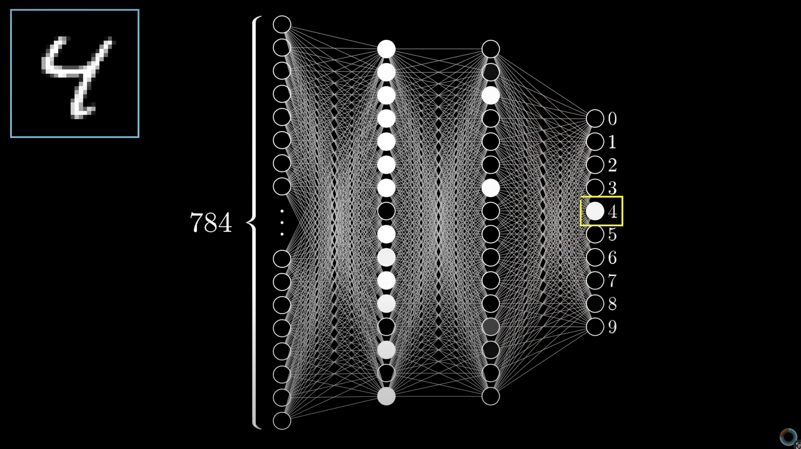
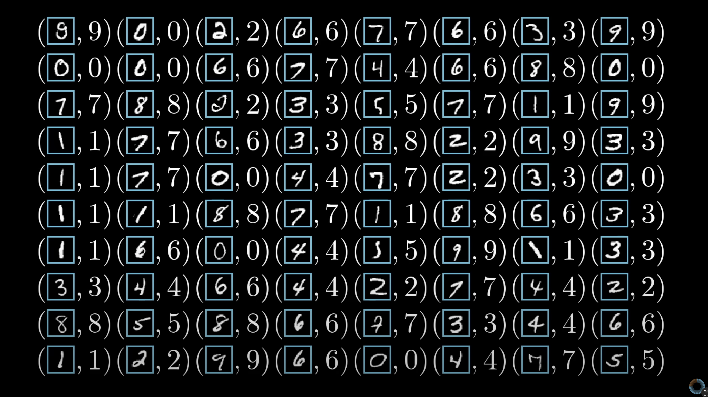
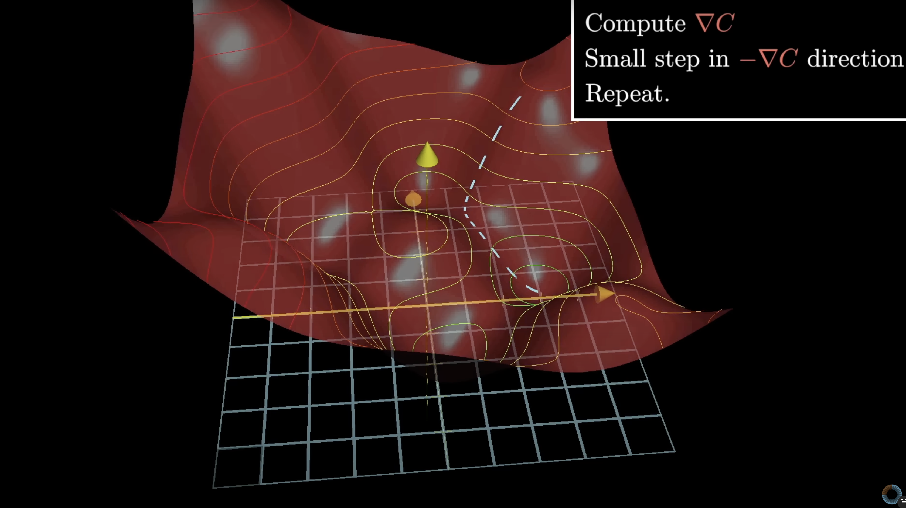
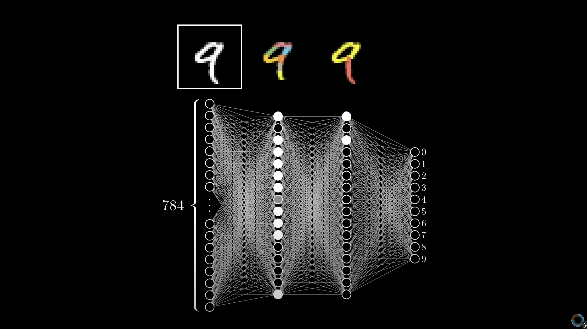
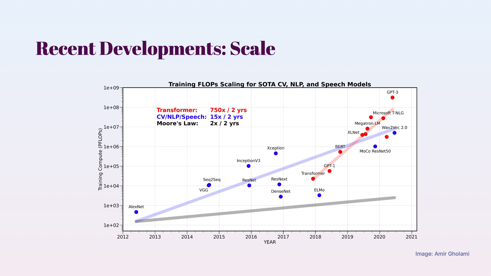
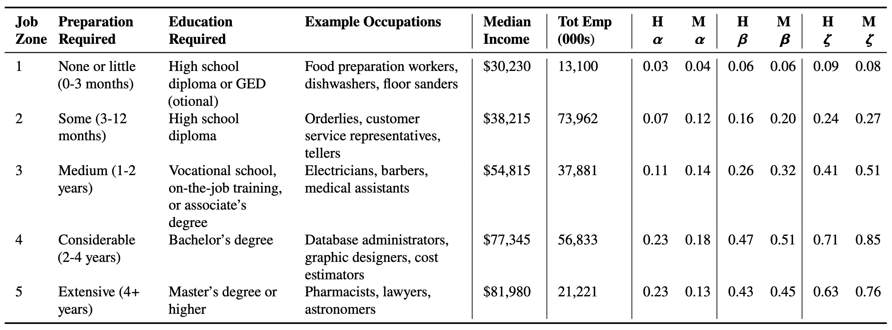
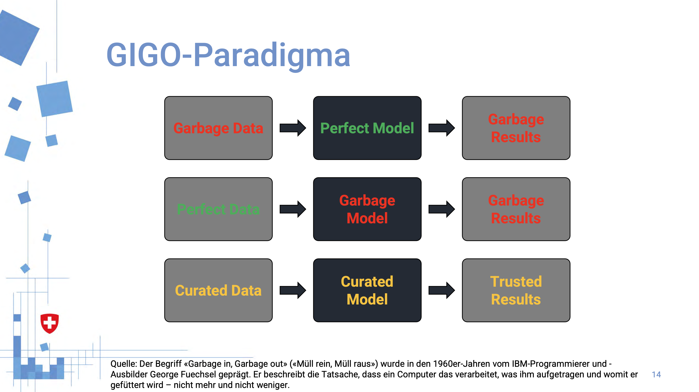
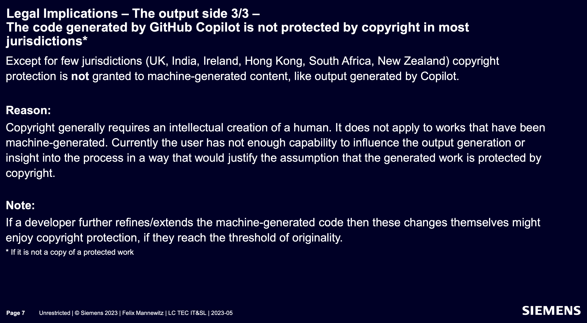

(interaktiver) Vortrag & Diskussion

## 💡 Künstliche 
## 🧠 Intelligenz

> 12.07.2023 - LC Müllheim-Neuenburg
--


[@MarkusTiede](https://twitter.com/MarkusTiede) 👨‍🏫 [DSL](https://www.bfh.ch/de/forschung/forschungsbereiche/digital-sustainability-lab/) & [IPST](https://www.bfh.ch/de/forschung/forschungsbereiche/public-sector-transformation/) @BFH

Executive Director @ [CH Open](https://www.ch-open.ch) + OK @ [DINAcon](https://dinacon.ch)


--
[](https://www.bfh.ch/de/aktuell/fachveranstaltungen/transform-2023/)
---
# 🎯 Ziel(e)

```md [1,8|2|3|4|8|]
Vortrag ~ 45'
- 🔤 Einleitung & Grundlagen
- 👁️ Ueberblick & (aktuelle) Anwendung(en)
- 🔭 Ausblick & Risiken

🍽️

Diskussion ~ 45'
```
--
# 🤔

## Wie nutzt ihr bereits KI?
im Alltag - privat / beruflich
--

--
### aktiv / bewusst 🤓
- Sprachassistenten: Siri, Alexa; Inhalte abspielen, erkennen
- Fotos (Aufnehmen, Finden, Bearbeiten) am Mobilgerät, ...
- Texte verfassen / übersetzen: eMail, Anträge, Anschreiben, ...
- offline: Drohne
- ...

### passiv / unbewusst 😮
- YouTube (Urheberrechtsanalyse, Transkript zB Untertitel, ...)
- Werbung (zT gefühlt auch im Pricing)
- ...
---
# 🔤
## Einleitung & Grundlagen
--
LLMs am Beispiel: ~~Chat~~**GPT**


> **G**enerative **P**re-trained **T**ransformer
--


_weighted_ **network** of _layered, biased_ **neurons**
--


**automated** training
--


optimized, **directed learning**
--


layers with features
--
3Blue1Brown


[Neural Networks Introduction ~65'](https://www.youtube.com/watch?v=aircAruvnKk&list=PLZHQObOWTQDNU6R1_67000Dx_ZCJB-3pi)
---
# 👁️
## Ueberblick & (aktuelle) Anwendung(en)
--

--
# text

https://chat.openai.com

https://open-assistant.io/chat/
--
# bild

midjourney: https://youtu.be/7iqgor2AmXQ

stable diffusion: https://youtu.be/DaLS4Baiqgk
--
## note: prompt engineering 

use ChatGPT for prompts
--
# audio
sprache: https://youtu.be/oyZ87y38zsI&t=293s

musik: https://youtu.be/7NK_JOkuSVY?t=69
--
# video ✅
--
# programming ✅
---
# 🔭
## Ausblick & Risiken
--
# merging

https://youtu.be/AlSCx-4d51U?t=160
--
## jobs



p17: https://arxiv.org/pdf/2303.10130.pdf
--


## biases
--

--
## loops


AI learns from AI
--


ip: https://opensource.siemens.com/events/2023/
--


black box
--


monopols: data & hardware
--

---
## Diskussion
--
[](https://www.youtube.com/watch?v=1KQc6zHOmtU)

https://youtu.be/1KQc6zHOmtU
--
[](https://www.youtube.com/watch?v=WXuK6gekU1Y)

https://youtu.be/WXuK6gekU1Y
--
